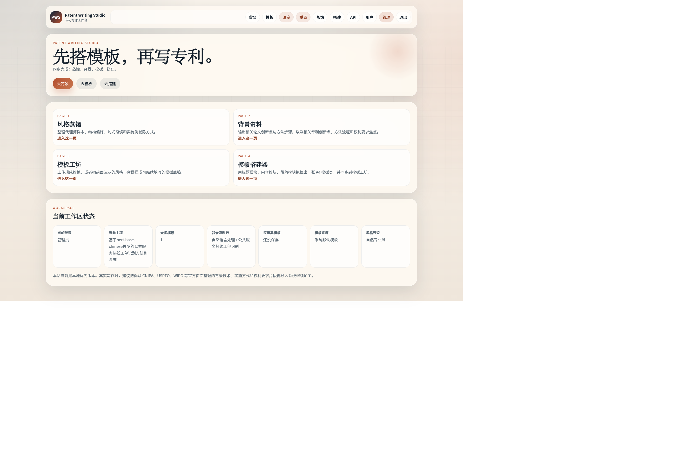
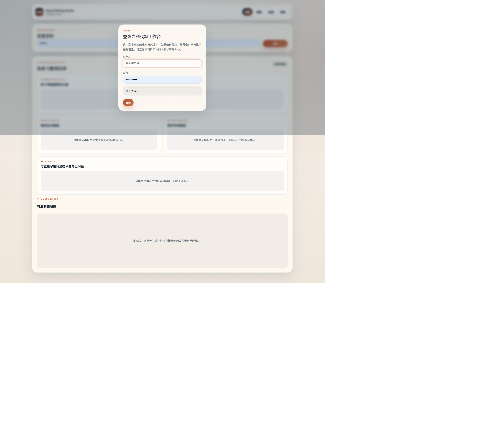
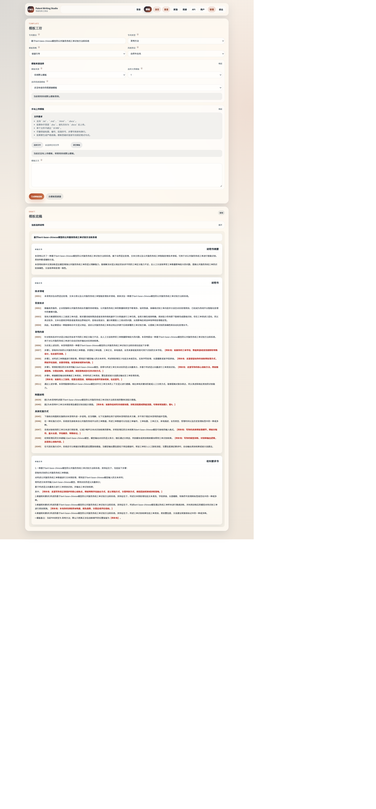
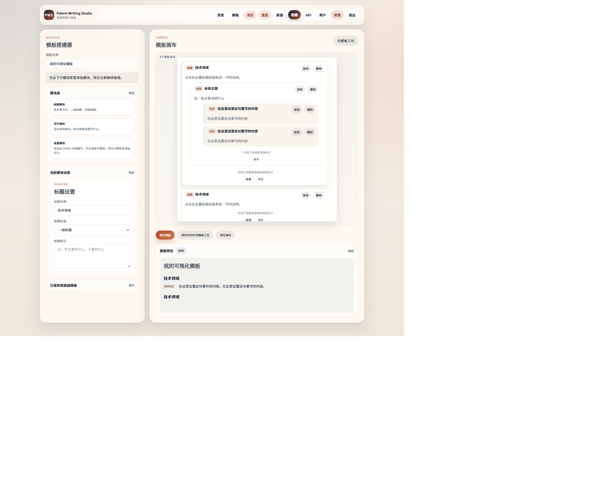
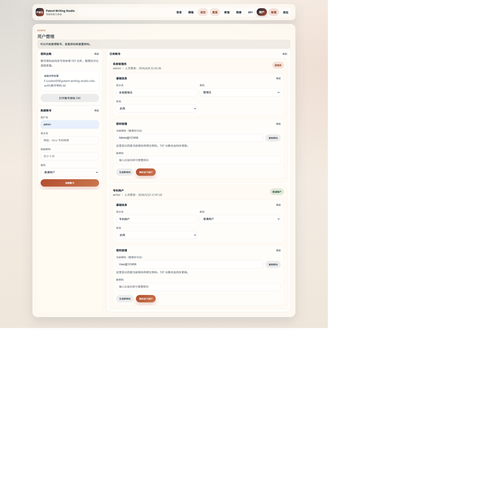

# Patent Writing Studio Role Auth

一个本地优先的专利 LLM 写作工作台，用于把“资料检索、风格沉淀、背景资料整理、模板生成、模板搭建、账号权限管理”串成一条可演示的专利撰写辅助流程。

这个项目基于 `patent-writing-studio` 原型扩展了登录体系和角色权限：

- `admin` 管理员：可使用全部写作功能，可管理用户账号，可查看和修改全站 API 设置。
- `user` 普通用户：可使用风格蒸馏、背景资料、模板工坊和模板搭建器，但不能查看或修改 API 设置，也不能管理其他账号。

## 项目截图

### 首页与工作区概览



### 背景资料



### 风格蒸馏


### 模板工坊



### 模板搭建器



### 用户管理



## 核心功能

1. 风格蒸馏

   根据代理师或示例专利文本，提取结构偏好、句式特征、实施方式铺陈习惯和权利要求表达倾向，形成后续模板生成可复用的风格画像。

2. 背景资料生成

   围绕技术主题整理相关论文创新点、方法步骤、专利线索、权利要求关注点和官方检索入口，辅助用户先构建现有技术认知，再进入撰写。

3. 模板工坊

   将主题、背景资料、风格画像和可选上传模板融合，生成带留白位的专利底稿模板，方便继续补充技术方案、实施例和权利要求。

4. 模板搭建器

   提供模块化的 A4 模板编辑界面，可用标题、段落、内容块等模块搭建模板页面，并同步到模板工坊。

5. LLM 接入

   支持 OpenAI 兼容的 `chat/completions` 接口配置，包括 API Key、Base URL 和 Model。未配置模型时，系统可回退到本地规则生成，保证演示流程不中断。

6. 角色权限与本地数据隔离

   管理员与普通用户权限分离；用户、会话、工作区、聊天记录和 API 设置保存在项目本地 `.local/` 目录中。该目录已被 `.gitignore` 排除，不会上传到 GitHub。

## 技术栈

- Node.js 原生 HTTP 服务：负责静态页面、API 路由、登录会话和本地文件存储。
- 原生 JavaScript 前端：多页面工作台，无前端构建步骤，便于本地运行和面试演示。
- Node.js Test Runner：使用 `node --test` 进行模块级测试。
- GSAP：用于前端交互动画。
- Python/PowerShell 辅助脚本：用于 Word 模板解析和旧版 `.doc` 到 `.docx` 的转换流程。

## 目录结构

```text
patent-writing-studio-role-auth/
├─ public/                  # 前端页面、样式和浏览器端逻辑
├─ src/                     # 后端业务模块
│  ├─ ai-orchestrator.js     # LLM 增强编排
│  ├─ background-generator.js# 背景资料生成
│  ├─ chat-engine.js         # 模板搭建器对话逻辑
│  ├─ llm-client.js          # OpenAI 兼容接口客户端
│  ├─ style-distiller.js     # 风格蒸馏
│  ├─ template-engine.js     # 专利模板生成
│  ├─ user-store.js          # 用户、密码、会话和权限
│  └─ workspace-store.js     # 按用户隔离的工作区
├─ tests/                   # 自动化测试
├─ scripts/                 # 端口管理和文档解析脚本
├─ docs/screenshots/        # 页面功能截图
├─ server.js                # Node HTTP 服务入口
├─ package.json             # 项目脚本和依赖
└─ README.md
```

## 本地运行

运行前需要安装：

- Windows PowerShell
- Node.js 20+
- 浏览器

`npm` 是 Node.js 自带的包管理命令，用来安装依赖和执行项目脚本。

1. 进入项目目录：

```powershell
Set-Location 'E:\codex空间\patent-writing-studio-role-auth'
```

2. 安装依赖：

```powershell
npm install
```

3. 启动服务：

```powershell
npm start
```

正常输出类似：

```text
Patent Writing Studio Role Auth is running at http://localhost:3036
```

4. 打开浏览器访问：

```text
http://localhost:3036
```

5. 停止服务：

如果当前 PowerShell 正在运行 `npm start`，按 `Ctrl + C`。

如果怀疑 3036 端口被旧进程占用，在项目目录运行：

```powershell
npm run status
npm run stop
```

## 默认演示账号

```text
管理员：admin / Admin@123456
普通用户：writer / User@123456
```

建议首次登录后修改默认密码。面试或公开演示时建议说明：这是本地演示账号，真实部署时应改成环境变量、数据库、加密密钥和更严格的鉴权策略。

## 页面入口

- 首页：`http://localhost:3036/`
- 背景资料：`http://localhost:3036/background.html`
- 风格蒸馏：`http://localhost:3036/style.html`
- 模板工坊：`http://localhost:3036/template.html`
- 模板搭建器：`http://localhost:3036/chat.html`
- 用户管理：`http://localhost:3036/users.html`

说明：

- 旧版“检索向导”已经并入 `背景资料`。
- 旧版“智能助手”已经改成 `模板搭建器`。

## API 设置

只有管理员可以打开右上角的 `API` 设置：

- `API Key`：模型平台密钥。
- `Base URL`：OpenAI 兼容接口地址，例如 `https://api.openai.com/v1`。
- `Model`：模型名称。

配置会保存在 `.local/app-settings.json`，不会提交到 GitHub。普通用户只能使用写作功能，不能看到敏感配置。

## 数据隔离

这个版本不再把草稿只存浏览器本地，而是改成按用户分别保存：

- 用户账号
- 登录会话
- 每个用户的工作区
- 每个用户的聊天记忆
- 全站 API 设置

这些运行数据保存在 `.local/` 目录中，并已被 `.gitignore` 排除。

## 测试

```powershell
npm test
```

当前测试覆盖：

- 背景资料生成
- 聊天状态和上传文件摘要
- LLM 返回 JSON 解析
- API 设置归一化
- 风格蒸馏
- 模板生成
- 用户、密码和权限
- 工作区数据归一化

## 安全说明

- `.local/`、`node_modules/`、日志文件、PID 文件、账号密码文本文件都已加入 `.gitignore`。
- GitHub 仓库只保存源码、测试、示例数据和功能截图。
- 当前项目是本地优先原型，不建议直接暴露到公网生产环境。

## 面试讲解

面试讲解稿见：

[docs/interview-guide.md](docs/interview-guide.md)
