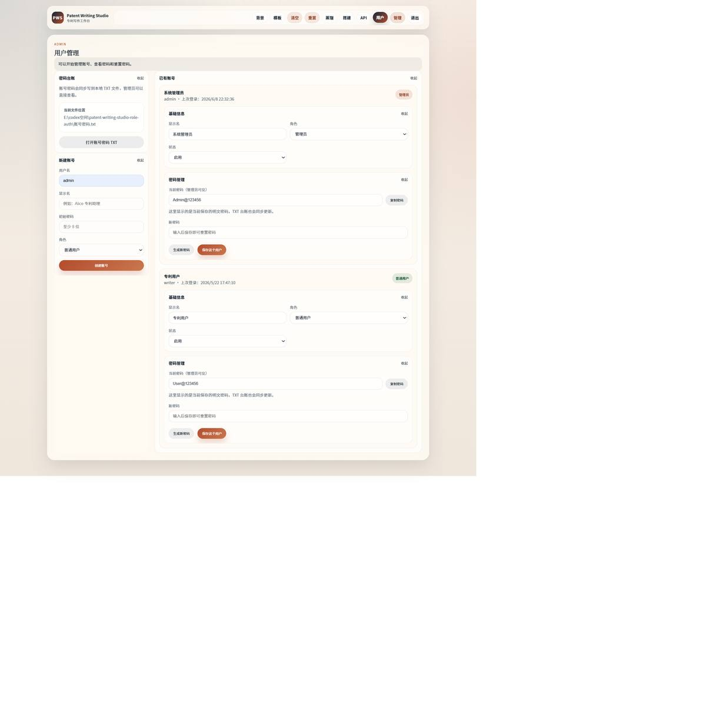

# Patent Writing Studio Role Auth

涓€涓湰鍦颁紭鍏堢殑涓撳埄 LLM 鍐欎綔宸ヤ綔鍙帮紝鐢ㄤ簬鎶娾€滆祫鏂欐绱€侀鏍兼矇娣€銆佽儗鏅祫鏂欐暣鐞嗐€佹ā鏉跨敓鎴愩€佹ā鏉挎惌寤恒€佽处鍙锋潈闄愮鐞嗏€濅覆鎴愪竴鏉″彲婕旂ず鐨勪笓鍒╂挵鍐欒緟鍔╂祦绋嬨€?
杩欎釜椤圭洰鍩轰簬 `patent-writing-studio` 鍘熷瀷鎵╁睍浜嗙櫥褰曚綋绯诲拰瑙掕壊鏉冮檺锛?
- `admin` 绠＄悊鍛橈細鍙娇鐢ㄥ叏閮ㄥ啓浣滃姛鑳斤紝鍙鐞嗙敤鎴疯处鍙凤紝鍙煡鐪嬪拰淇敼鍏ㄧ珯 API 璁剧疆銆?- `user` 鏅€氱敤鎴凤細鍙娇鐢ㄩ鏍艰捀棣忋€佽儗鏅祫鏂欍€佹ā鏉垮伐鍧婂拰妯℃澘鎼缓鍣紝浣嗕笉鑳芥煡鐪嬫垨淇敼 API 璁剧疆锛屼篃涓嶈兘绠＄悊鍏朵粬璐﹀彿銆?
## 椤圭洰鎴浘

### 棣栭〉涓庡伐浣滃尯姒傝


### 鑳屾櫙璧勬枡


### 椋庢牸钂搁


### 妯℃澘宸ュ潑


### 妯℃澘鎼缓鍣?
![妯℃澘鎼缓鍣╙(docs/screenshots-small/05-builder.jpg)

### 鐢ㄦ埛绠＄悊



## 鏍稿績鍔熻兘

1. 椋庢牸钂搁

   鏍规嵁浠ｇ悊甯堟垨绀轰緥涓撳埄鏂囨湰锛屾彁鍙栫粨鏋勫亸濂姐€佸彞寮忕壒寰併€佸疄鏂芥柟寮忛摵闄堜範鎯拰鏉冨埄瑕佹眰琛ㄨ揪鍊惧悜锛屽舰鎴愬悗缁ā鏉跨敓鎴愬彲澶嶇敤鐨勯鏍肩敾鍍忋€?
2. 鑳屾櫙璧勬枡鐢熸垚

   鍥寸粫鎶€鏈富棰樻暣鐞嗙浉鍏宠鏂囧垱鏂扮偣銆佹柟娉曟楠ゃ€佷笓鍒╃嚎绱€佹潈鍒╄姹傚叧娉ㄧ偣鍜屽畼鏂规绱㈠叆鍙ｏ紝杈呭姪鐢ㄦ埛鍏堟瀯寤虹幇鏈夋妧鏈鐭ワ紝鍐嶈繘鍏ユ挵鍐欍€?
3. 妯℃澘宸ュ潑

   灏嗕富棰樸€佽儗鏅祫鏂欍€侀鏍肩敾鍍忓拰鍙€変笂浼犳ā鏉胯瀺鍚堬紝鐢熸垚甯︾暀鐧戒綅鐨勪笓鍒╁簳绋挎ā鏉匡紝鏂逛究缁х画琛ュ厖鎶€鏈柟妗堛€佸疄鏂戒緥鍜屾潈鍒╄姹傘€?
4. 妯℃澘鎼缓鍣?
   鎻愪緵妯″潡鍖栫殑 A4 妯℃澘缂栬緫鐣岄潰锛屽彲鐢ㄦ爣棰樸€佹钀姐€佸唴瀹瑰潡绛夋ā鍧楁惌寤烘ā鏉块〉闈紝骞跺悓姝ュ埌妯℃澘宸ュ潑銆?
5. LLM 鎺ュ叆

   鏀寔 OpenAI 鍏煎鐨?`chat/completions` 鎺ュ彛閰嶇疆锛屽寘鎷?API Key銆丅ase URL 鍜?Model銆傛湭閰嶇疆妯″瀷鏃讹紝绯荤粺鍙洖閫€鍒版湰鍦拌鍒欑敓鎴愶紝淇濊瘉婕旂ず娴佺▼涓嶄腑鏂€?
6. 瑙掕壊鏉冮檺涓庢湰鍦版暟鎹殧绂?
   绠＄悊鍛樹笌鏅€氱敤鎴锋潈闄愬垎绂伙紱鐢ㄦ埛銆佷細璇濄€佸伐浣滃尯銆佽亰澶╄褰曞拰 API 璁剧疆淇濆瓨鍦ㄩ」鐩湰鍦?`.local/` 鐩綍涓€傝鐩綍宸茶 `.gitignore` 鎺掗櫎锛屼笉浼氫笂浼犲埌 GitHub銆?
## 鎶€鏈爤

- Node.js 鍘熺敓 HTTP 鏈嶅姟锛氳礋璐ｉ潤鎬侀〉闈€丄PI 璺敱銆佺櫥褰曚細璇濆拰鏈湴鏂囦欢瀛樺偍銆?- 鍘熺敓 JavaScript 鍓嶇锛氬椤甸潰宸ヤ綔鍙帮紝鏃犲墠绔瀯寤烘楠わ紝渚夸簬鏈湴杩愯鍜岄潰璇曟紨绀恒€?- Node.js Test Runner锛氫娇鐢?`node --test` 杩涜妯″潡绾ф祴璇曘€?- GSAP锛氱敤浜庡墠绔氦浜掑姩鐢汇€?- Python/PowerShell 杈呭姪鑴氭湰锛氱敤浜?Word 妯℃澘瑙ｆ瀽鍜屾棫鐗?`.doc` 鍒?`.docx` 鐨勮浆鎹㈡祦绋嬨€?
## 鐩綍缁撴瀯

```text
patent-writing-studio-role-auth/
鈹溾攢 public/                  # 鍓嶇椤甸潰銆佹牱寮忓拰娴忚鍣ㄧ閫昏緫
鈹溾攢 src/                     # 鍚庣涓氬姟妯″潡
鈹? 鈹溾攢 ai-orchestrator.js     # LLM 澧炲己缂栨帓
鈹? 鈹溾攢 background-generator.js# 鑳屾櫙璧勬枡鐢熸垚
鈹? 鈹溾攢 chat-engine.js         # 妯℃澘鎼缓鍣ㄥ璇濋€昏緫
鈹? 鈹溾攢 llm-client.js          # OpenAI 鍏煎鎺ュ彛瀹㈡埛绔?鈹? 鈹溾攢 style-distiller.js     # 椋庢牸钂搁
鈹? 鈹溾攢 template-engine.js     # 涓撳埄妯℃澘鐢熸垚
鈹? 鈹溾攢 user-store.js          # 鐢ㄦ埛銆佸瘑鐮併€佷細璇濆拰鏉冮檺
鈹? 鈹斺攢 workspace-store.js     # 鎸夌敤鎴烽殧绂荤殑宸ヤ綔鍖?鈹溾攢 tests/                   # 鑷姩鍖栨祴璇?鈹溾攢 scripts/                 # 绔彛绠＄悊鍜屾枃妗ｈВ鏋愯剼鏈?鈹溾攢 docs/screenshots/        # 鍘熷椤甸潰鍔熻兘鎴浘
鈹溾攢 docs/screenshots-small/  # README 灞曠ず鐢ㄥ帇缂╂埅鍥?鈹溾攢 server.js                # Node HTTP 鏈嶅姟鍏ュ彛
鈹溾攢 package.json             # 椤圭洰鑴氭湰鍜屼緷璧?鈹斺攢 README.md
```

## 鏈湴杩愯

杩愯鍓嶉渶瑕佸畨瑁咃細

- Windows PowerShell
- Node.js 20+
- 娴忚鍣?
`npm` 鏄?Node.js 鑷甫鐨勫寘绠＄悊鍛戒护锛岀敤鏉ュ畨瑁呬緷璧栧拰鎵ц椤圭洰鑴氭湰銆?
1. 杩涘叆椤圭洰鐩綍锛?
```powershell
Set-Location 'E:\codex绌洪棿\patent-writing-studio-role-auth'
```

2. 瀹夎渚濊禆锛?
```powershell
npm install
```

3. 鍚姩鏈嶅姟锛?
```powershell
npm start
```

姝ｅ父杈撳嚭绫讳技锛?
```text
Patent Writing Studio Role Auth is running at http://localhost:3036
```

4. 鎵撳紑娴忚鍣ㄨ闂細

```text
http://localhost:3036
```

5. 鍋滄鏈嶅姟锛?
濡傛灉褰撳墠 PowerShell 姝ｅ湪杩愯 `npm start`锛屾寜 `Ctrl + C`銆?
濡傛灉鎬€鐤?3036 绔彛琚棫杩涚▼鍗犵敤锛屽湪椤圭洰鐩綍杩愯锛?
```powershell
npm run status
npm run stop
```

## 榛樿婕旂ず璐﹀彿

```text
绠＄悊鍛橈細admin / Admin@123456
鏅€氱敤鎴凤細writer / User@123456
```

寤鸿棣栨鐧诲綍鍚庝慨鏀归粯璁ゅ瘑鐮併€傞潰璇曟垨鍏紑婕旂ず鏃跺缓璁鏄庯細杩欐槸鏈湴婕旂ず璐﹀彿锛岀湡瀹為儴缃叉椂搴旀敼鎴愮幆澧冨彉閲忋€佹暟鎹簱銆佸姞瀵嗗瘑閽ュ拰鏇翠弗鏍肩殑閴存潈绛栫暐銆?
## 椤甸潰鍏ュ彛

- 棣栭〉锛歚http://localhost:3036/`
- 鑳屾櫙璧勬枡锛歚http://localhost:3036/background.html`
- 椋庢牸钂搁锛歚http://localhost:3036/style.html`
- 妯℃澘宸ュ潑锛歚http://localhost:3036/template.html`
- 妯℃澘鎼缓鍣細`http://localhost:3036/chat.html`
- 鐢ㄦ埛绠＄悊锛歚http://localhost:3036/users.html`

璇存槑锛?
- 鏃х増鈥滄绱㈠悜瀵尖€濆凡缁忓苟鍏?`鑳屾櫙璧勬枡`銆?- 鏃х増鈥滄櫤鑳藉姪鎵嬧€濆凡缁忔敼鎴?`妯℃澘鎼缓鍣╜銆?
## API 璁剧疆

鍙湁绠＄悊鍛樺彲浠ユ墦寮€鍙充笂瑙掔殑 `API` 璁剧疆锛?
- `API Key`锛氭ā鍨嬪钩鍙板瘑閽ャ€?- `Base URL`锛歄penAI 鍏煎鎺ュ彛鍦板潃锛屼緥濡?`https://api.openai.com/v1`銆?- `Model`锛氭ā鍨嬪悕绉般€?
閰嶇疆浼氫繚瀛樺湪 `.local/app-settings.json`锛屼笉浼氭彁浜ゅ埌 GitHub銆傛櫘閫氱敤鎴峰彧鑳戒娇鐢ㄥ啓浣滃姛鑳斤紝涓嶈兘鐪嬪埌鏁忔劅閰嶇疆銆?
## 鏁版嵁闅旂

杩欎釜鐗堟湰涓嶅啀鎶婅崏绋垮彧瀛樻祻瑙堝櫒鏈湴锛岃€屾槸鏀规垚鎸夌敤鎴峰垎鍒繚瀛橈細

- 鐢ㄦ埛璐﹀彿
- 鐧诲綍浼氳瘽
- 姣忎釜鐢ㄦ埛鐨勫伐浣滃尯
- 姣忎釜鐢ㄦ埛鐨勮亰澶╄蹇?- 鍏ㄧ珯 API 璁剧疆

杩欎簺杩愯鏁版嵁淇濆瓨鍦?`.local/` 鐩綍涓紝骞跺凡琚?`.gitignore` 鎺掗櫎銆?
## 娴嬭瘯

```powershell
npm test
```

褰撳墠娴嬭瘯瑕嗙洊锛?
- 鑳屾櫙璧勬枡鐢熸垚
- 鑱婂ぉ鐘舵€佸拰涓婁紶鏂囦欢鎽樿
- LLM 杩斿洖 JSON 瑙ｆ瀽
- API 璁剧疆褰掍竴鍖?- 椋庢牸钂搁
- 妯℃澘鐢熸垚
- 鐢ㄦ埛銆佸瘑鐮佸拰鏉冮檺
- 宸ヤ綔鍖烘暟鎹綊涓€鍖?
## 瀹夊叏璇存槑

- `.local/`銆乣node_modules/`銆佹棩蹇楁枃浠躲€丳ID 鏂囦欢銆佽处鍙峰瘑鐮佹枃鏈枃浠堕兘宸插姞鍏?`.gitignore`銆?- GitHub 浠撳簱鍙繚瀛樻簮鐮併€佹祴璇曘€佺ず渚嬫暟鎹拰鍔熻兘鎴浘銆?- 褰撳墠椤圭洰鏄湰鍦颁紭鍏堝師鍨嬶紝涓嶅缓璁洿鎺ユ毚闇插埌鍏綉鐢熶骇鐜銆?
## 闈㈣瘯璁茶В

闈㈣瘯璁茶В绋胯锛?
[docs/interview-guide.md](docs/interview-guide.md)
